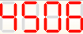
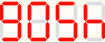

# Number Flipper
A JavaScript console app that turns integers into strings based on their appearance on an upside down seven-segment display. For example, an input of `4506` would result in an output of `GOSH`:

 &nbsp;&nbsp; 

Created for the 3/11/25 Sloth Bytes coding challenge.

## How to use
1. Make sure [NodeJS](https://nodejs.org) is installed on your system
2. Click **Code > Download ZIP** at the top of this page
3. Unzip/extract all from the ZIP file
4. Open a new terminal session in the root directory of the project (where the above files and folders are located)
5. Run `node index.js`
